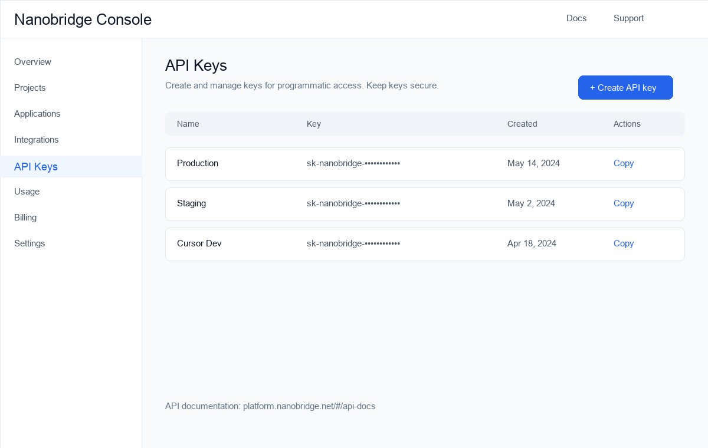
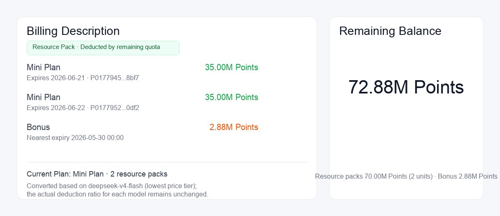
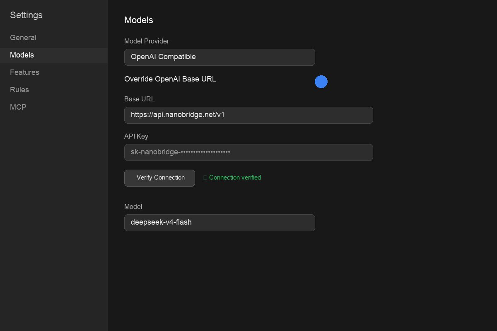
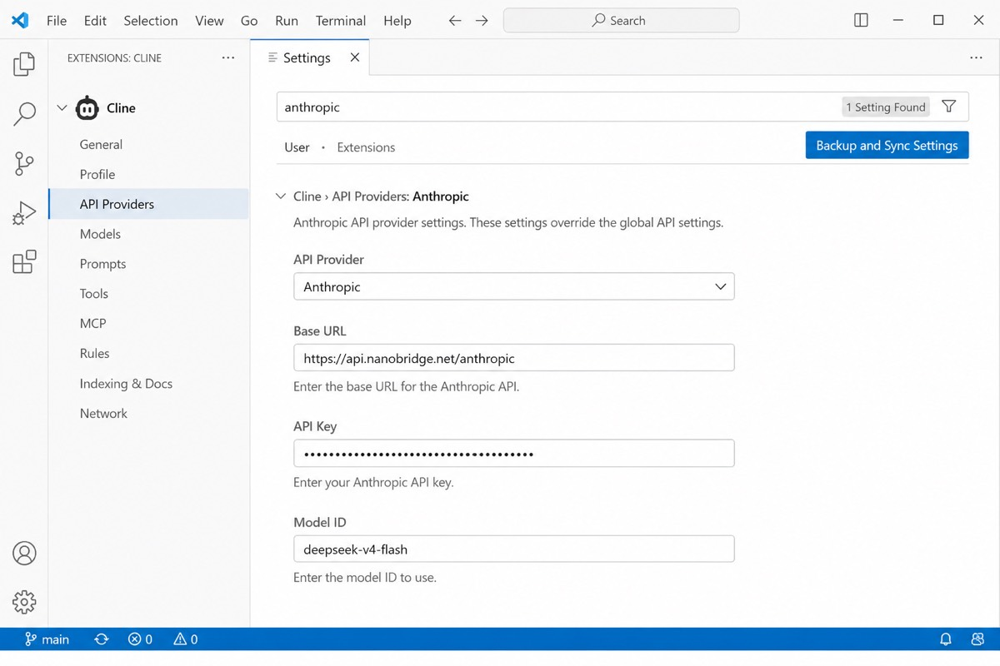

# OpenRouter Alternative in 2026

Looking for an OpenRouter alternative?

This repository compares different ways to access LLM APIs — OpenRouter, direct providers, and API gateways — and shows how [Nanobridge](https://www.nanobridge.ai) works as a unified gateway for coding tools like Cursor, Cline, Continue, and Aider.

## Links

| Resource | URL |
|----------|-----|
| Website | [nanobridge.ai](https://www.nanobridge.ai) |
| Console (API keys & billing) | [platform.nanobridge.net](https://platform.nanobridge.net) |
| API documentation | [platform.nanobridge.net/#/api-docs](https://platform.nanobridge.net/#/api-docs) |

## Why People Look For OpenRouter Alternatives

Common reasons include:

- Higher API costs at scale
- Rate limits during peak hours
- Limited access to specific models
- Need for direct provider pricing
- Better latency requirements
- Extra markup on top of upstream pricing

## Popular Alternatives

### Direct Providers

Examples:

- DeepSeek
- OpenAI
- Anthropic
- Google Gemini

Pros:

- Direct pricing
- Official support
- Predictable billing

Cons:

- Multiple API keys
- Different API formats
- More integration work across tools

### API Gateways

API gateways provide a unified endpoint while routing to multiple upstream models.

Benefits:

- One API format (OpenAI and/or Anthropic compatible)
- Easier integration across coding agents
- Faster switching between models
- Regional nodes for lower latency

**[Nanobridge](https://www.nanobridge.ai)** is one such gateway — OpenAI-compatible for Cursor/Continue/Aider, and Anthropic-compatible for Cline/Claude Code.

## Comparison

| Feature | OpenRouter | Direct Provider | Nanobridge Gateway |
|---------|------------|-----------------|----------------------|
| Setup | Easy | Medium | Easy |
| Pricing | Varies + markup | Official | Transparent gateway pricing |
| Model access | Multi-provider | Single provider | Multi-model catalog |
| API format | OpenAI-style | Provider-specific | OpenAI + Anthropic |
| Coding tools | Via OpenAI API | Per-tool setup | Cursor, Cline, Continue, Aider |
| Regional nodes | Limited | Provider-dependent | DE / SG / US |

## Nanobridge Quick Start

### 1. Create an API key

Sign up and create a key in the [Nanobridge console](https://platform.nanobridge.net).

### 2. Pick a regional Base URL

**API requests go to the gateway hosts** — not the console URL (`platform.nanobridge.net`).

| Region | OpenAI Base (Cursor, Continue, Aider) | Anthropic Base (Cline, Claude Code) |
|--------|---------------------------------------|-------------------------------------|
| Germany (default) | `https://api.nanobridge.net/v1` | `https://api.nanobridge.net/anthropic` |
| Singapore | `https://api-sg.nanobridge.net/v1` | `https://api-sg.nanobridge.net/anthropic` |
| United States | `https://api-us.nanobridge.net/v1` | `https://api-us.nanobridge.net/anthropic` |

The same API key works across all regions.

### 3. Supported models

| Model ID | Notes |
|----------|-------|
| `deepseek-v4-flash` | **Recommended default** — balanced cost and latency |
| `deepseek-v4-pro` | Stronger reasoning |
| `deepseek-v3.2` | DeepSeek V3.2 |

Full catalog, parameters, and pricing: [API documentation](https://platform.nanobridge.net/#/api-docs)

### 4. Monitor usage

Track remaining quota and billing in the console.

## DeepSeek For Coding

Many developers are switching to DeepSeek models for:

- Cursor
- Cline
- Continue
- Aider

because of lower token costs and strong coding performance.

### Cursor (OpenAI-compatible)

1. Open **Cursor → Settings → Models**
2. Enable **Override OpenAI Base URL**
3. Set Base URL to `https://api.nanobridge.net/v1` (or your regional node)
4. Paste your Nanobridge API key
5. Select model `deepseek-v4-flash`

Full guide: [Cursor + DeepSeek](https://github.com/nanobridgerafa/cursor-deepseek-guide)

### Cline (Anthropic-compatible)

1. Open **Cline → Settings → API Providers**
2. Set **API Provider** to **Anthropic**
3. Set **Base URL** to `https://api.nanobridge.net/anthropic`
4. Paste your API key and set **Model ID** to `deepseek-v4-flash`

Full guide: [Cline + DeepSeek](https://github.com/nanobridgerafa/cline-deepseek-guide)

## API Endpoints

Nanobridge exposes standard-compatible APIs:

- **OpenAI Chat Completions**: `POST /v1/chat/completions`
- **Model list**: `GET /v1/models`
- **Anthropic Messages**: `POST /v1/messages` (on the Anthropic base URL)
- **Streaming**: set `stream: true`; response is SSE
- **Auth**: `Authorization: Bearer <API_KEY>`

See the full reference with request/response examples in the [API docs](https://platform.nanobridge.net/#/api-docs).

## Common Mistakes

| Mistake | Fix |
|---------|-----|
| Using `platform.nanobridge.net` as Base URL | Use `api*.nanobridge.net` gateway hosts |
| Wrong protocol for the tool | Cursor → OpenAI base; Cline → Anthropic base |
| Retired model names | Use `deepseek-v4-flash`, `deepseek-v4-pro`, or `deepseek-v3.2` |
| 401 errors | Regenerate or copy the key from the [console](https://platform.nanobridge.net) |

## Related Guides

- [Cursor + DeepSeek](https://github.com/nanobridgerafa/cursor-deepseek-guide)
- [Cline + DeepSeek](https://github.com/nanobridgerafa/cline-deepseek-guide)
- [DeepSeek API Pricing](https://github.com/nanobridgerafa/deepseek-api-pricing)

## License

MIT

---

Nanobridge is an independent inference gateway and is not affiliated with OpenRouter, OpenAI, Anthropic, or DeepSeek.
